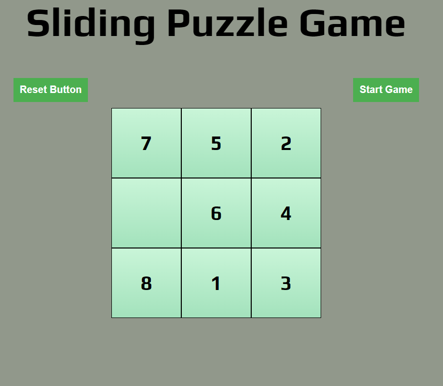
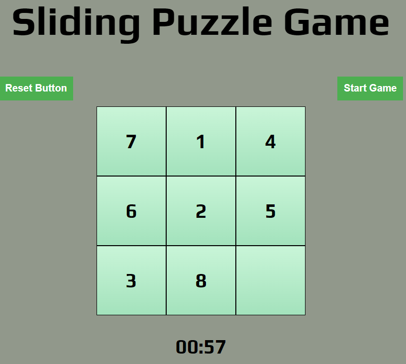
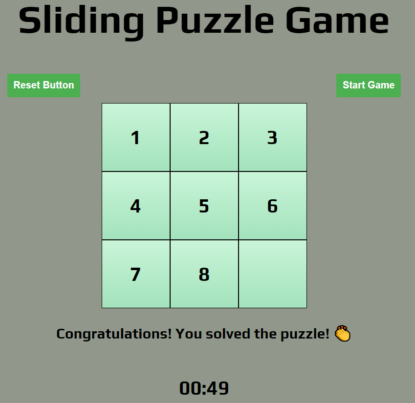
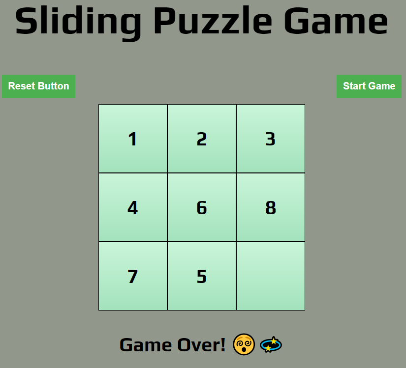

# Sliding Puzzle Game
## Date: 11.07.2024
### By: Ebrahim Khalil

**[GitHub](https://github.com/Ebrahim-COD)**

### ***Description:***

This is a classic **Sliding Puzzle Game** implemented in JavaScript. The objective of the game is to rearrange the tiles in ascending numerical order (from 1 to 8) plus an empty space to win the game.

**Try the Game:** [Sliding Puzzle Game](https://ebrahim-cod.github.io/Sliding-Puzzle-Game/)

### ***Features:***

* The "Start Game" button to begin the game. The tiles will be shuffled randomly, and a countdown timer of 60 seconds will start.

* Move Tiles: Click on any tile adjacent to the empty space to move it into that space.

* Objective: Rearrange the tiles so they are in ascending numerical order from 1 to 8, with the empty space at the end (bottom right).

* Win Condition: If you successfully rearrange the tiles in the correct order before the timer reaches 0, you win the game.

* Lose Condition: If the timer reaches 0 before you solve the puzzle, you lose the game.

* Reset: At any time, you can click the "Reset" button to shuffle the tiles again and restart the game.

### ***Implementation Details:***

1. #### JavaScript Functions:

    * **shuffleNumbers:** Randomly shuffles the array of tile numbers while ensuring the puzzle remains solvable based on the concept of inversions count theory.

    * **moveTiles:** Determines if a tile can be moved into the empty space based on its current position.

    * **swapNumbers:** Swaps the clicked tile with the empty space on the board.

    * **checkforWinner:** Checks if the current tile configuration matches the winning configuration to determine if the game is won.

    * **timer:** Implements a countdown timer that updates every second until it reaches zero, signaling the end of the game.

2. #### Event Listeners:

    * Each tile on the board has an event listener attached to handle clicks. When clicked, it attempts to move the tile into the empty space.

    * Event listeners are also attached to the "Reset" and "Timer" buttons to trigger their respective functionalities.

3. #### Initialization:

    * **init:** Initializes the game by shuffling the tiles, rendering the board, and setting up the initial state.

### ***Screenshots:***

1. Board Layout:

2. Starting the Game:

3. Winning the Game: 

4. Losing the Game:

### ***Technologies Used:***

* HTML/CSS: Basic structure and styling.

* JavaScript: Game logic and interactivity.

### Future Updates:

1. [ ] Implement easy, medium, and hard difficulty levels:

    * Easy: Smaller grid (e.g., 3x3) with fewer tiles.
    * Medium: Standard grid size (e.g., 4x4) with moderate complexity.
    * Hard: Larger grid size (e.g., 5x5) with more tiles and increased challenge.

2. [x] Completed Update:

    * Timer functionality added.
    * Reset button implemented.

### ***Credits:***

* [Inversion Count Theory](https://math.stackexchange.com/questions/293527/how-to-check-if-a-8-puzzle-is-solvable)

* [Swapping 2 Grids](https://www.procoding.org/c-program-to-swap-two-numbers-using-pointers)
